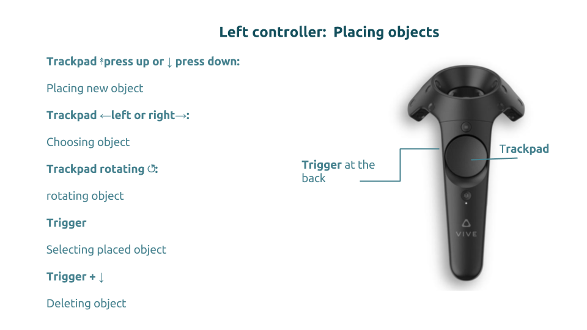

# GeoVR - Urban Planning

## Demo
> [If you have an HTC Vive with accompanying controllers, click here to try it out now!](https://crend02.github.io/GeoVR).

## About
> study project in winter term 2016/17 at ifgi.


The goal of this study project was to built a Virtual Reality (VR) application which would facilitate the envisionment of urban planning for normal citizens. In particular it covers the "Hamannplatz" area in Muenster Coerde, Germany. To achieve this goal we used the web based VR framework [A-frame](https://aframe.io/).


## Technologies

Software we used 

* The WebVR Framework [A-frame](https://aframe.io/)

* ES6 & WebPack
 
* .obj Models were created with [MagicalVoxel](https://ephtracy.github.io/)

* [Overpass Turbo](https://overpass-turbo.eu/) we collacted data of the studing area.

* [qgis2threejs-plugin] (http://qgis2threejs.readthedocs.io/en/docs-release/) to provide the planning data as a .dae & .obj Models


### Project Management

The projectteam used the SCRUM software development method in combination with weekly hackathons. 

The developers of the project are:
#####  [Norwin Roosen](https://github.com/noerw)
#####  [Clara Rendel](https://github.com/crend02)
#####  [Saad Sarfraz](https://github.com/saadsarfrazz)
#####  [Marc Dragunski](https://github.com/mdragunski)
#####  [Marike Meijer](https://github.com/marikemau)

## repo structure
This repository more or less follows the gitflow structure, without a develop branch.
So: build your features on separate branches, and pull request to `master` :^)

## Installation

## Build Setup

``` bash
# install dependencies
npm install

# serve with hot reload at localhost:8080
npm run dev

# build for production with minification
npm run build
```

For detailed explanation on how things work, consult the [docs for vue-loader](http://vuejs.github.io/vue-loader).


### Developer

### User

## Architecture

## Functionalities


### Controllers 

{ width=50% }

### 3D Photoview

To give the user a short overview of the current state of Hamannplatz the application contains a 3D Photoview. This view was built by 8 different 360° photos which should provide orientation in an abstract VR-environment. Furthermore, the user has the possibility to switch around the photoview caused by selecting a green sphere. The green spheres point to the following  360° photo regarding the users latest positions.   

* Use the trigger to switch to 3D Photoview

* Use the laserpoint to select one of the spheres to switch around 

* Use the trigger to switch back to Buildingview


### Buildingview

Planning area
10 different fixed object-types
Place, rotate, move and delete with respect to constraints
#### Surrounding buildings:
In order to simulate the surrounding environment i.e. buildings present in surrounding area, COLLADA model was used. COLLADA model is an interchange file format for interactive 3D applications.
The model was prepared using an opensource plugin in QGIS software called Qgis2threejs. The tool allows to take shapefiles as input and convert it to 3D buildings given a specified height ratio.
The model can then be exported in different file formats including COLLADA model. The model then can simply imported in AFrame.


###### Data:
Data to be used in Qgis2threejs was downloaded from openStreetMap. The main files required were the boundary areas for individual buildings. The area to be reconstructed was also differentiated from environment and exported as separate layer.It helps in marking the area of interest and differentiating it from the surrounding area in virtual environment.

link to images here
#### Teleporting
Moving in 3D immerisive environment is one key basic task user wants to perform. This functionality was implemented using aframe-teleport-controls plugin. User can teleport to a distant point by pointing to that place a pressing a button.
A curved ray displays the user pointing direction. It also responses to user if the teleport is feasible for the pointed location e.g. it changes its color from green to red when pointing to restricted location e.g. sky.

link to images here

#### Constraints


## Video

## Limitations & Future Work

During the planning process one of our requirements was to save and store the current session in the buildingview as a map. The import and export function should be one of the feature that could be implemented in future work.

Manipulating Objects
Scaling
Draw new Objects

Interface for changing basic data sets (planning area, photos, collada model)


## license
`?`
