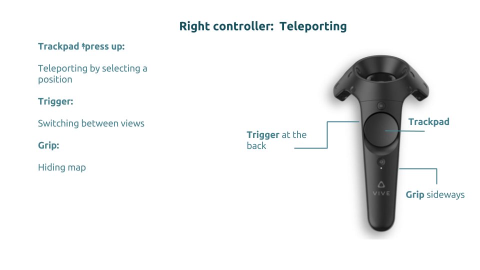

## Usage & Functionality
The application allows the user to desginate areas to specific landuses by
placing visual representation of these uses onto the planning area.
The planning area is pre-populated with 360° imagery of the current state of
the area to provide better orientation within the VR environment.

### Controller Mapping
This is the mapping of controller buttons that is used for the functioniality
explained below:

Movement of the player is handled via a **teleport mechanic**.
Moving in 3D immersive environment is one key basic task a user wants to
perform. This functionality was implemented using `aframe-teleport-controls`
component. The user can teleport to a distant point by pointing to that place
and pressing the right-hand controllers trackpad.
A curved ray displays the user pointing direction. It also responds to the user
if the teleport is feasible for the pointed location: It changes its color
from green to red when pointing to a restricted location (e.g. the sky).

### View Modes
There are two modes ('planning view' & 'photo view'), which provide different
views onto the planning area.
After launching the application and entering VR mode (press `f`), the user is
located in the planning view, with two hand-tracked controllers to use.

#### 3D Photo view
The application contains a 3D photo view to give the user a brief overview of
the current state of Hamannplatz. This view was built by 8 different 360° photos
which should provide orientation in an abstract VR-environment. Furthermore, the
user has the possibility to switch around the photoview caused by selecting a
green sphere. The green spheres point to the following  360° photo regarding the
users latest positions.

* Use the trigger to switch to 3D Photoview
* Use the laserpoint to select one of the spheres to switch around
* Use the trigger to switch back to Buildingview

#### Planning view
* Planning area
* 10 different fixed object-types
* Place, rotate, move and delete with respect to constraints

link to images here

#### Constraints
